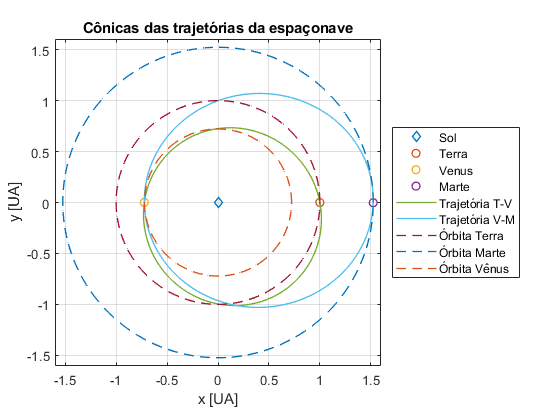

# Transferência Terra → Marte otimizada

> Otimização de transferência interplanetária Terra → Marte (com e sem
> swing-by por Vênus) via problema de Lambert + Particle Swarm
> Optimization. Projeto original em MATLAB (MVO-41 / ITA, 2020) e
> simulador interativo em JavaScript rodando no navegador.

<p align="center">
  
</p>

<p align="center">
  <a href="https://chicomcastro.github.io/optimized-Earth-Mars-transfer/"></a>
  <a href="https://github.com/chicomcastro/optimized-Earth-Mars-transfer/actions/workflows/deploy-pages.yml"></a>
  <a href="https://github.com/chicomcastro/optimized-Earth-Mars-transfer/actions/workflows/e2e.yml"></a>
  <a href="LICENSE"></a>
</p>

## ✨ Demo interativa

**https://chicomcastro.github.io/optimized-Earth-Mars-transfer/**

Editor de parâmetros em tempo real, PSO ao vivo com gráfico de
convergência, porkchop plot, comparação direta vs swing-by — tudo
no navegador, sem servidor.

## O problema

Achar a trajetória que minimiza o ΔV total para uma missão
Terra → Marte, comparando duas estratégias:

| Estratégia | Manobras | Parâmetros otimizados |
|---|---|---|
| **Direta** (Hohmann-like) | partida da Terra · captura em Marte | fase de Marte, tempo de voo |
| **Swing-by por Vênus** | partida · sobrevôo em Vênus · captura em Marte | + fase de Vênus, t<sub>TV</sub>, t<sub>VM</sub>, periapsis em Vênus |

Modelagem:

- **Patched conics** — dentro de cada SOI considera-se só a gravidade local
- Órbitas planetárias circulares e coplanares
- Manobras impulsivas, swing-by tratado como deflexão pura

## 🏆 Resultados-chave

| Cenário | ΔV total | Parâmetros ótimos |
|---|---|---|
| Direta otimizada | **~5,71 km/s** | fase de Marte ≈ 180° (oposição), t ≈ 259 d (Hohmann clássica) |
| Swing-by por Vênus | **~8,02 km/s** | fase Vênus ≈ 180°, t<sub>TV</sub> ≈ 121 d, t<sub>VM</sub> ≈ 215 d |

Para esta missão específica (LEO → LMO com órbitas circulares), o swing-by
por Vênus **não vale a pena** — adiciona uma manobra a mais e a deflexão
em Vênus não economiza ΔV suficiente. O swing-by só ganha em missões aos
planetas externos.

## 🚀 Como rodar

### Versão web (recomendada)

Basta abrir a [demo](https://chicomcastro.github.io/optimized-Earth-Mars-transfer/).
Para rodar localmente:

```bash
npm install
npm run serve      # serve docs/ em http://127.0.0.1:8765
```

### Versão MATLAB (original)

```matlab
% no MATLAB / Octave
main
```

Configura cenário e bounds em `main.m`. O PSO roda, salva os melhores
em `results-*.txt`, e `plotar_resultado.m` plota a trajetória.

### Testes E2E

```bash
npm install
npx playwright install --with-deps chromium
npm run test:e2e   # 8 cenários, ~19s, gera screenshots/
npm run report     # abre relatório HTML com traces e vídeos
```

Detalhes em [`tests/README.md`](tests/README.md). No CI, cada PR ganha um
comentário com as 9 capturas de tela embutidas inline.

## 🧠 Como funciona

1. **Problema de Lambert** — dadas duas posições e um tempo de voo,
   resolve a órbita kepleriana que conecta os pontos. Implementação:
   algoritmo de Izzo (rápido, Newton–Raphson) com fallback
   Lancaster–Blanchard + melhorias de Gooding para robustez.
2. **Custo da missão** — soma de ΔV impulsivos em três pontos: saída
   da Terra, swing-by (se houver), captura em Marte.
3. **PSO** — partícula i atualiza:
   ```
   v ← w·v + φ_p·r_p·(p_best − x) + φ_g·r_g·(g_best − x)
   ```
   com `w=0.9`, `φ_p=0.6`, `φ_g=0.8`. Espaço de busca multimodal e
   descontínuo nas bordas onde Lambert falha — daí o PSO em vez de
   gradiente.

## 📁 Estrutura

```
.
├── docs/                    # Versão web (servida no GitHub Pages)
│   ├── index.html           # Landing + simulador
│   ├── js/
│   │   ├── constants.js     # Constantes físicas (dados.m)
│   │   ├── lambert.js       # Izzo + Lancaster-Blanchard (lambert.m)
│   │   ├── simulate.js      # Função custo (simulate.m + custo.m)
│   │   ├── pso.js           # PSO assíncrono (pso.m)
│   │   ├── orbit.js         # Reconstrução de cônicas
│   │   ├── visualize.js     # Plotly (trajetória + porkchop)
│   │   └── plotly.min.js    # Plotly vendorizado
│   ├── figures/             # Diagramas do relatório
│   └── references/          # PDFs do trabalho final
├── tests/e2e/               # Suite Playwright
├── .github/workflows/
│   ├── deploy-pages.yml     # Deploy automático da master
│   └── e2e.yml              # Testes + screenshots no PR
└── *.m                      # Código MATLAB original
```

## 📚 Referências

- Relatório final: [`docs/references/MVO_41_trabalho_final.pdf`](docs/references/MVO_41_trabalho_final.pdf)
- Lambert solver: **Rody Oldenhuis** (BSD), implementando Izzo (ESA) e
  Lancaster–Blanchard–Gooding
- Curtis, H. — *Orbital Mechanics for Engineering Students*
- Vallado, D. A. — *Fundamentals of Astrodynamics and Applications*
- Battin, R. — *An Introduction to the Mathematics and Methods of Astrodynamics*

## 📄 Licença

[BSD-2-Clause](LICENSE). Trabalho final da disciplina MVO-41 (Mecânica
Orbital) do ITA, 2020.
